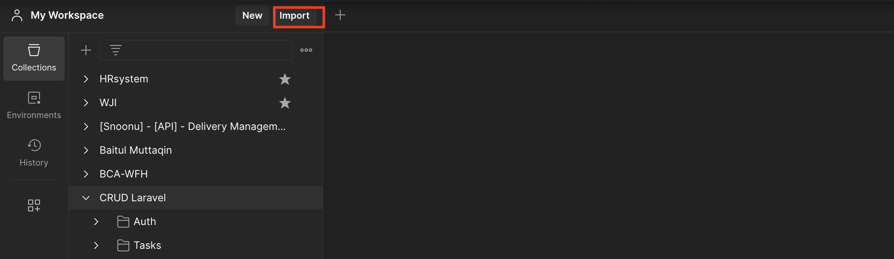

## Requirement

- PHP 8.1
- PostgreSql
- Composer

## Installation Guide

- Clone Project
- Create .env file and filled the database connection credential
- Run : composer install
- Run : php artisan migrate
- Run : php artisan db:seed
- Run : php artisan serve

## Unit Test

- Run : php artisan test

## Postman documentation

- https://api.postman.com/collections/4120694-cd7e3572-4a5f-4a6e-8335-123c3126db0a?access_key=PMAT-01HPJ0CZTNN0ZTJRTFTZ5G06MF

### Guide

- copy postman link above
- 
- click button import and then paste copied postman link
